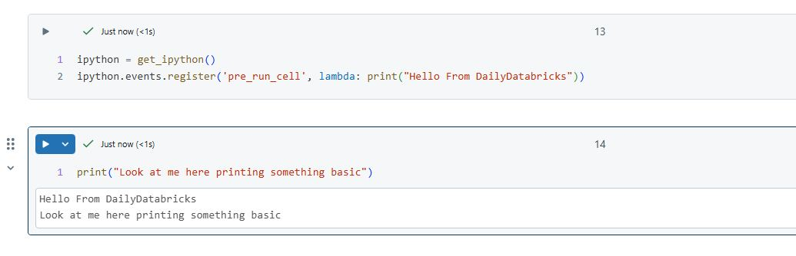

## Summary

-   Learn how to leverage IPython events in Databricks to execute code before or after every cell in a notebook is executed
-   Implement Aspect-Oriented Programming (AOP) patterns to add cross-cutting concerns like logging and DataFrame validation
-   Demonstrate practical examples for automatic DataFrame counting and execution logging

## Introduction

Databricks notebooks are powerful, but sometimes you need more control over execution flow and logging. Enter IPython events - a mechanism that allows you to hook into the notebook execution lifecycle.

## Understanding IPython Events

IPython provides several event hooks (code that is called when a specfic activity happens e.g. someone runs a notebook cell in databricks) that allow you to execute code before and after cell execution. The main events we'll focus on are:

-   `pre_run_cell`: Fires before a cell execution
-   `post_run_cell`: Fires after a cell execution
-   `pre_execute`: Fires before any code execution (including non-interactive)
-   `post_execute`: Fires after any code execution

::: {.callout-important title="Cross-Language Support" appearance="simple"}
A powerful feature of IPython events in Databricks is that once registered in Python, they will execute for cells in other languages too! This means for example you can:

-   Set up logging in Python and capture execution information from SQL cells
-   Monitor DataFrame operations across PySpark and Scala notebooks
-   Track performance metrics for R, Python, and SQL code uniformly
:::

## Basic Implementation

Here's the basic code to call some in your Databricks notebook everytime before a cell runs and after its ran:

``` python
ipython = get_ipython()
ipython.events.register('pre_run_cell', <Some Code or Function You Want to run each time this event is called >)
ipython.events.register('post_run_cell', <Some Code or Function You Want to run each time this event is called >)
```

This prints hello from your favourite tips site everytime a cell is queued to be run.

Result:
``` python
ipython = get_ipython()
ipython.events.register('pre_run_cell', lambda: print()"Hello From DailyDatabricks"))
```




This means you can start to build up generic code that runs every time a specfic event is triggered. Often this can lead to useful AOP patterns

## Benefits and Applications

-   **Automated Quality Checks**: Validate DataFrame transformations automatically
-   **Enhanced Debugging**: Track execution flow and catch issues early
-   **Audit Trail**: Maintain comprehensive logs of notebook execution
-   **Performance Optimization**: Monitor execution time and resource usage
-   **Cross-Cutting Concerns**: Implement security checks, logging, and monitoring without cluttering business logic

::: {.callout-note title="What is Aspect-Oriented Programming (AOP)?" appearance="simple"}
Aspect-Oriented Programming is a programming paradigm that allows you to add behavioral modifications to existing code without changing the code itself. This often means any cross cutting concerns that you want todo everywhere without having to implement that code everywhere. Common use cases include:

-   Logging
-   Performance monitoring
-   Security checks
-   Transaction management

In our examples, we're using IPython events to implement AOP patterns by injecting logging and validation behavior around notebook cell execution.
:::

## Logging Implementation

Here's how to implement execution logging:

``` python
def logging_pre(info):
    try:
        print("Debug Logging to Console or Your Preferened Logging tool:")
        # You can access cell content via info.raw_cell
    except Exception:
        info.raw_cell = ''

def logging_post(info):
    try:
        print(f"Debug Logging to Console or Your Preferened Logging tool. Cell successfully executed: {info.raw_cell}")
    except Exception:
        info.raw_cell = ''
```

::: {.callout-caution title="Available Context Information" appearance="simple"}
The `info` object provides rich context about cell execution: - `raw_cell`: The cell's source code - `store_history`: Whether this execution is stored in history - `silent`: If True, suppress all output - `cell_id`: Unique identifier for the cell - `shell_futures`: Future statements in the cell
:::

## Advanced Use Case: DataFrame Validation

::: {.callout-tip title="Practical Example" appearance="simple"}
One powerful application is automatically tracking DataFrame counts before and after transformations:

``` python
def inspect_spark_dataframes(code_namespace):
    """
    Inspects a given namespace for Spark DataFrames and prints their counts.
    """
    for name, obj in code_namespace.items():
        if not name.startswith('_') and isinstance(obj, DataFrame):
            try:
                count = obj.count()
                print(f"The dataframe called '{name}' has the following count: {count}")
            except Exception as e:
                print(f"Error counting DataFrame '{name}': {str(e)}")

def pre_counts(info):
    print("Validating pre transformation Dataframe counts")
    inspect_spark_dataframes(globals())

def post_counts(info):
    print("Validating post transformation Dataframe counts")
    inspect_spark_dataframes(globals())

ipython = get_ipython()
ipython.events.register('pre_run_cell', pre_counts)
ipython.events.register('post_run_cell', post_counts)
```

This code automatically tracks DataFrame row counts before and after cell execution, helping catch data issues early.
:::

## Additional AOP Patterns Suggestions

Here are some other useful patterns you can implement:

1.  **Performance Monitoring**:

``` python
def performance_pre(info):
    info.start_time = time.time()

def performance_post(info):
    duration = time.time() - info.start_time
    print(f"Cell execution took {duration:.2f} seconds")
```

2.  **Memory Usage Tracking**:

``` python
def memory_tracking(info):
    from pyspark.sql import SparkSession
    spark = SparkSession.builder.getOrCreate()
    print(spark.sparkContext.statusTracker().getExecutorMetrics())
```

## Further Reading

-   [IPython Events Documentation](https://ipython.readthedocs.io/en/stable/config/callbacks.html)
-   [PySpark DataFrame API](https://spark.apache.org/docs/latest/api/python/reference/pyspark.sql/dataframe.html)

Remember to initialize these patterns at the start of your notebook.